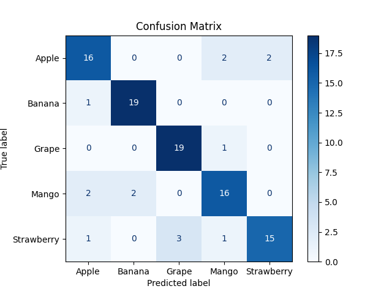

# Fruit Classification

This project is a **Fruit Classifier** application that identifies fruits from uploaded images using a Convolutional Neural Network (CNN). The project includes training the model, testing its performance, and deploying it using Flask.

## Features

- Classifies fruits into categories: Apple, Banana, Grape, Mango, and Strawberry.
- Web-based interface for uploading images and viewing predictions.
- Training, validation, and testing using a MobileNetV2-based CNN model.

## Project Structure

```
.
├── App.py                # Flask application for deployment
├── BuildTheModel.py      # Script to build and train the CNN model
├── ModelTesting.py       # Script to evaluate the model and generate reports
├── training_log.csv      # CSV file containing training metrics
├── templates/
│   └── index.html        # HTML template for the web interface
├── static/
│   └── styles.css        # CSS for the web interface
├── Outputs/              # Folder for storing generated reports and plots
└── Datasets/             # Folder for training, validation, and test datasets
```

## Setup and Installation

### Prerequisites

- Python 3.8 or higher
- TensorFlow
- Flask
- OpenCV
- Matplotlib
- Pandas
- scikit-learn

### Installation

1. Clone the repository:
    ```bash
    git clone https://github.com/your_username/fruit-classifier.git
    cd fruit-classifier
    ```

2. Install required dependencies:
    ```bash
    pip install -r requirements.txt
    ```

3. Organize datasets:
    - Place your datasets under `Datasets/` with subfolders for each fruit category.
    - Ensure separate folders for `train`, `valid`, and `test` datasets.

## How to Use

### Training the Model

1. Modify paths in `BuildTheModel.py` to match your dataset structure.
2. Run the script to train the model and save it as `fruit_classifier.keras`:
    ```bash
    python BuildTheModel.py
    ```

### Testing the Model

1. Run `ModelTesting.py` to evaluate the model and generate reports:
    ```bash
    python ModelTesting.py
    ```
2. Find outputs (e.g., confusion matrix, classification report) in the `Outputs/` folder.

### Running the Web Application

1. Start the Flask app:
    ```bash
    python App.py
    ```
2. Open your browser and go to `http://127.0.0.1:5000`.
3. Upload an image to classify the fruit and view predictions.

## Screenshots


## Model Details

- Base Model: MobileNetV2 pretrained on ImageNet.
- Custom Layers: GlobalAveragePooling2D and Dense layers.
- Optimizer: Adam.
- Loss Function: Categorical Crossentropy.

## Acknowledgments

- Datasets for this project were sourced from publicly available fruit image datasets.
- Inspired by the power of transfer learning and Flask for deploying machine learning applications.

## License

This project is licensed under the MIT License. See the `LICENSE` file for details.
